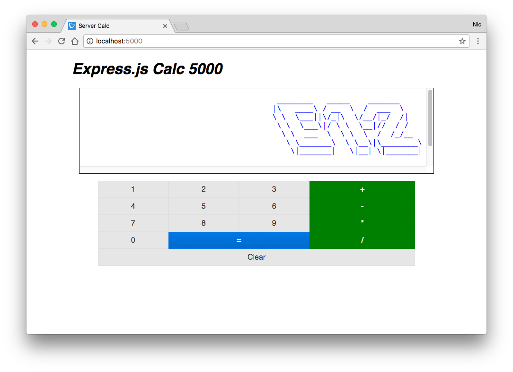

# nodejsCalculator

This was the second weekend challenge completed during the Full Stack Engineering program at Prime Digital Academy.

The assignment for this challenge was to build a server-side calculator along with a HTML/jQuery front-end to send and display calculations.

## Technologies Used

* Server-side
  * NodeJS
  * Express
  * [Figlet.js](https://www.npmjs.com/package/figlet)
  * [Math.js](http://mathjs.org/)
* Front-end
  * HTML
  * CSS
  * JavaScript
  * jQuery
  * [Pure.css](https://purecss.io/)

## Preview

